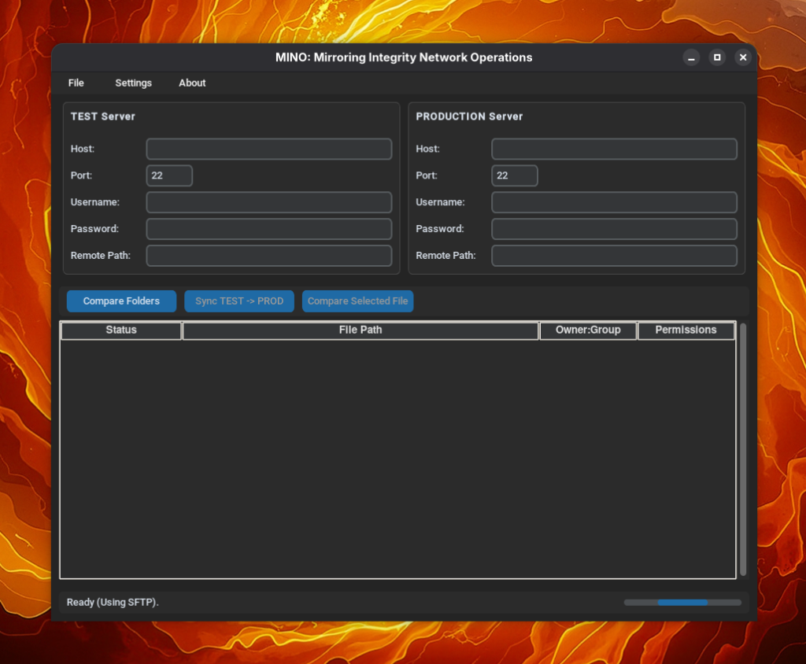

# MINO: Mirroring Integrity Network Operations

MINO is a powerful and intuitive tool designed to facilitate the synchronization and management of files between a **TEST** server and a **PRODUCTION** server via SFTP. It provides a visual interface to compare directories, identify differences, and synchronize changes with confidence.



## Features

*   **Dual-Pane Comparison**: Visually compare the contents of two remote server directories side-by-side.
*   **Hash-Based Verification**: Uses MD5 hashing to ensure file integrity and accurately detect changes, even if timestamps differ.
*   **Selective Synchronization**:
    *   **Sync All**: Synchronize entire folders from TEST to PROD.
    *   **Single File Sync**: Right-click to sync individual files immediately.
*   **Integrated Editor**: Edit remote files directly within the application and save changes back to the server.
*   **Diff Viewer**: View line-by-line differences between files on TEST and PROD.
*   **Backup System**:
    *   **Remote Backup**: Create a backup copy of the production folder on the server itself before syncing.
    *   **Local Backup**: Download a backup of the production folder to your local machine.
*   **Workspace Management**: Save and load server configurations (Host, User, Path, etc.) to quickly switch between environments. Supports secure password saving.
*   **Attribute Management**: View and modify file permissions (chmod) and ownership (chown).

## Installation

1.  Clone the repository:
    ```bash
    git clone https://github.com/Negatorto/mino.git
    cd mino
    ```

2.  Install the required dependencies:
    ```bash
    pip install -r requirements.txt
    ```

## Usage

1.  Run the application:
    ```bash
    python main.py
    ```

2.  **Configure Servers**:
    *   Enter the connection details (Host, Port, Username, Password, Remote Path) for both the **TEST Server** (Source) and **PRODUCTION Server** (Destination).

3.  **Compare**:
    *   Click **"Compare Folders"** to scan both servers and see the differences.
    *   Files will be listed with their status: `IDENTICAL`, `DIFFERENT`, `ONLY ON TEST`, or `ONLY ON PROD`.

4.  **Synchronize**:
    *   **Full Sync**: Click **"Sync TEST -> PROD"** to open the synchronization window. You can choose to backup the destination first and whether to delete files that are only on PROD.
    *   **Single File**: Right-click a file in the list and select **"Sync File (TEST -> PROD)"**.

5.  **Edit & Diff**:
    *   Select a file and click **"Compare Selected File"** (or right-click) to view content differences.
    *   In the Diff window, use the **"Edit TEST"** or **"Edit PROD"** buttons to modify files directly.

## Requirements

*   Python 3.x
*   `customtkinter`
*   `paramiko`

## License

This project is licensed under the **GNU General Public License v3.0**.
See the [LICENSE](LICENSE) file for details. ♥️
